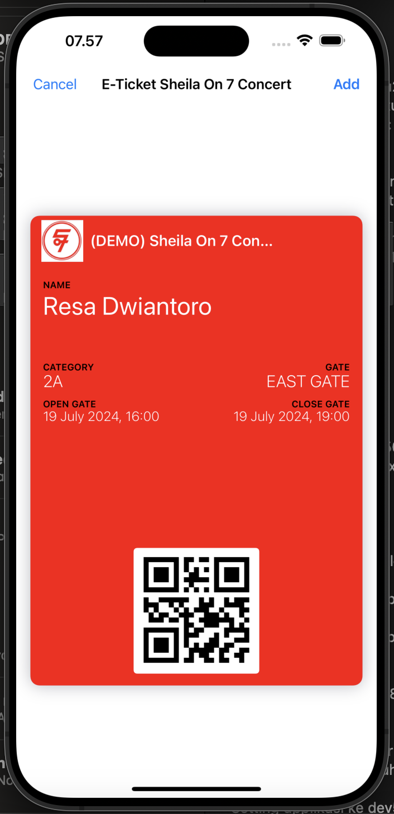
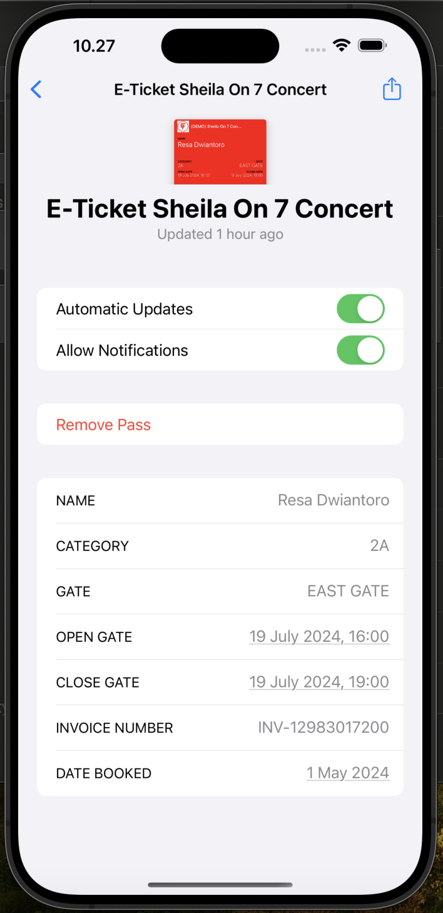

# Apple Pass With Passkit-Generator
This simple project to create apple pass (.pkpass) using [passkit-generator](https://www.npmjs.com/package/passkit-generator) with node js.
On This case I'm creating E-Ticket for concert with generic pass.
I Also add some sample pass on SamplePasses folders or download on [apple-website](https://developer.apple.com/services-account/download?path=/iOS/Wallet_Support_Materials/WalletCompanionFiles.zip)

## Setup the project
1. ``` npm install ```
2. Copy APPLEWWDR.pem, pass.pem, signing.key on credential folders
3. Setting .env file.
4. run on terminal ```node generate-pass.js```

## Result
Here's the result of pass that I created.
For Apple pass we just allow to create on 3 level (PrimaryFields, SecondaryFields and AuxiliaryFields) and for the rest of information can store in details (Backfields).

### Pass Preview: 


### Pass Details:


